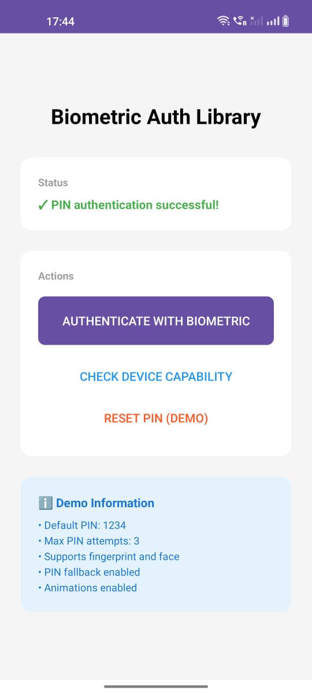

# 🔐 Biometric Authentication Library

[](https://kotlinlang.org)
[](LICENSE)
[](#)
[](https://jitpack.io/#Excelsior-Technologies-Community/BiometricAuthKit)

**Biometric Authentication Library** is a production-ready Android library that provides secure and customizable biometric authentication with fingerprint, face unlock, and PIN fallback support. Features a beautiful custom UI, comprehensive error handling, and enterprise-grade security.

---

## 📸 Preview



---

## ✨ Features

- **Multiple Authentication Methods**: Fingerprint, face unlock, and secure PIN fallback
- **Custom PIN Dialog**: Beautiful Material Design PIN entry interface with visual feedback
- **Comprehensive Security**: SHA-256 PIN hashing with salt, retry limits, and lockout mechanisms
- **Fully Customizable**: Configure colors, text, icons, and behavior via XML or Kotlin
- **Production Ready**: Clean architecture, sealed class results, and comprehensive error handling
- **Easy Integration**: Simple 3-step installation with callback-based API
- **Type-Safe Results**: Sealed class hierarchy for compile-time safety
- **Edge Case Handling**: Manages lockouts, hardware issues, enrollment status, and more
- **Lightweight**: Minimal dependencies, uses AndroidX Biometric API

---

## 📦 Installation

**Step 1:** Add JitPack repository to your root `build.gradle` (or `settings.gradle` for newer projects):

```gradle
allprojects {
    repositories {
        maven { url 'https://jitpack.io' }
    }
}
```

**Step 2:** Add dependency to your app module's `build.gradle`:

```gradle
dependencies {
       implementation 'com.github.Excelsior-Technologies-Community:BiometricAuthKit:1.0.0'
}
```

**Step 3:** Add required permissions to `AndroidManifest.xml`:

```xml
<uses-permission android:name="android.permission.USE_BIOMETRIC" />
<uses-permission android:name="android.permission.USE_FINGERPRINT" />

<uses-feature
    android:name="android.hardware.fingerprint"
    android:required="false" />
<uses-feature
    android:name="android.hardware.biometrics"
    android:required="false" />
```

---

## 🚀 Usage

### Basic Implementation

```kotlin
class MainActivity : AppCompatActivity() {
    
    private lateinit var authManager: BiometricAuthManager
    
    override fun onCreate(savedInstanceState: Bundle?) {
        super.onCreate(savedInstanceState)
        setContentView(R.layout.activity_main)
        
        // Initialize with default configuration
        val config = BiometricConfig.default(this)
        authManager = BiometricAuthManager(this, config)
        
        // Setup PIN (one-time during onboarding)
        authManager.setupPin("1234") { success ->
            if (success) {
                Toast.makeText(this, "PIN configured", Toast.LENGTH_SHORT).show()
            }
        }
        
        // Authenticate
        findViewById<Button>(R.id.btnAuthenticate).setOnClickListener {
            authenticate()
        }
    }
    
    private fun authenticate() {
        authManager.authenticate(object : BiometricCallback {
            override fun onAuthenticationSuccess(result: BiometricResult) {
                when (result) {
                    is BiometricResult.AuthenticationSucceeded -> {
                        Toast.makeText(this@MainActivity, "Authenticated!", Toast.LENGTH_SHORT).show()
                        proceedToSecureArea()
                    }
                    is BiometricResult.PinAuthenticationSucceeded -> {
                        Toast.makeText(this@MainActivity, "PIN verified!", Toast.LENGTH_SHORT).show()
                        proceedToSecureArea()
                    }
                }
            }
            
            override fun onAuthenticationError(result: BiometricResult) {
                when (result) {
                    is BiometricResult.AuthenticationFailed -> {
                        showError("Failed: ${result.errorMessage}")
                    }
                    is BiometricResult.BiometricNotEnrolled -> {
                        showError("Please enroll biometric in device settings")
                    }
                    is BiometricResult.BiometricLockout -> {
                        showError("Locked out for ${result.lockoutDurationSeconds}s")
                    }
                    is BiometricResult.PinAuthenticationFailed -> {
                        showError("Incorrect PIN. ${result.attemptsRemaining} attempts remaining")
                    }
                }
            }
            
            override fun onAuthenticationCancelled() {
                Toast.makeText(this@MainActivity, "Authentication cancelled", Toast.LENGTH_SHORT).show()
            }
        })
    }
    
    override fun onDestroy() {
        super.onDestroy()
        authManager.cleanup()
    }
}
```

---

## 💻 Kotlin Programmatic Configuration

### Custom Configuration Builder

```kotlin
val config = BiometricConfigBuilder(this)
    .setDialogTitle("Secure Login")
    .setDialogSubtitle("Verify your identity to continue")
    .setDialogDescription("Use fingerprint or face to authenticate")
    .setDialogBackgroundColor(Color.WHITE)
    .setDialogTitleColor(Color.parseColor("#1A237E"))
    .setDialogSubtitleColor(Color.parseColor("#5C6BC0"))
    .setSuccessColor(Color.parseColor("#4CAF50"))
    .setErrorColor(Color.parseColor("#F44336"))
    .setEnableFingerprint(true)
    .setEnableFaceAuth(true)
    .setEnablePinFallback(true)
    .setPinLength(4)
    .setMaxPinAttempts(3)
    .setEnableAnimations(true)
    .build()

val authManager = BiometricAuthManager(this, config)
```

### DSL-Style Callback (Concise Syntax)

```kotlin
authManager.authenticate(biometricCallback {
    onSuccess { result ->
        when (result) {
            is BiometricResult.AuthenticationSucceeded -> {
                println("Biometric authentication successful!")
            }
            is BiometricResult.PinAuthenticationSucceeded -> {
                println("PIN authentication successful!")
            }
        }
    }
    
    onError { result ->
        println("Authentication error: $result")
    }
    
    onCancel {
        println("User cancelled authentication")
    }
    
    onHelp { message ->
        println("Help: $message")
    }
})
```

### Device Capability Checking

```kotlin
// Check if biometric is available
val checker = BiometricCapabilityChecker(this)
val capability = checker.checkBiometricCapability()

when (capability) {
    is BiometricCapabilityChecker.BiometricCapability.Available -> {
        // Device supports and has biometric enrolled
        showMessage("Biometric authentication available")
    }
    is BiometricCapabilityChecker.BiometricCapability.NotEnrolled -> {
        // No biometric enrolled - prompt user to enroll
        showMessage("Please enroll fingerprint or face in device settings")
    }
    is BiometricCapabilityChecker.BiometricCapability.HardwareNotPresent -> {
        // Device doesn't have biometric hardware
        showMessage("This device doesn't support biometric")
    }
    is BiometricCapabilityChecker.BiometricCapability.NotAvailable -> {
        // Hardware temporarily unavailable
        showMessage("Biometric sensor temporarily unavailable")
    }
}

// Get human-readable message
val message = checker.getCapabilityMessage(capability)
```

### PIN Management

```kotlin
// Setup PIN (during onboarding)
authManager.setupPin("1234") { success ->
    if (success) {
        Log.d("Auth", "PIN setup successful")
    } else {
        Log.e("Auth", "PIN setup failed")
    }
}

// Check if PIN is already setup
val isPinConfigured = authManager.isPinSetup()
if (!isPinConfigured) {
    // Prompt user to setup PIN
}

// Clear PIN (for testing or user reset)
authManager.clearPin()
```

---

## 🔧 Configuration Attributes

### BiometricConfig Builder Methods

| Method | Parameter Type | Default | Description |
|--------|---------------|---------|-------------|
| setDialogTitle() | String | "Biometric Authentication" | Main dialog title |
| setDialogSubtitle() | String | "Verify your identity" | Dialog subtitle |
| setDialogDescription() | String | Default message | Dialog description text |
| setDialogBackgroundColor() | Int (Color) | White | Dialog background color |
| setDialogTitleColor() | Int (Color) | #212121 | Title text color |
| setDialogSubtitleColor() | Int (Color) | #757575 | Subtitle text color |
| setSuccessColor() | Int (Color) | #4CAF50 | Success state color |
| setErrorColor() | Int (Color) | #F44336 | Error state color |
| setEnableFingerprint() | Boolean | true | Enable fingerprint auth |
| setEnableFaceAuth() | Boolean | true | Enable face auth |
| setEnablePinFallback() | Boolean | true | Enable PIN fallback |
| setPinLength() | Int | 4 | PIN digit count (4 or 6) |
| setMaxPinAttempts() | Int | 3 | Max attempts before lockout |
| setEnableAnimations() | Boolean | true | Enable dialog animations |

### XML Configuration (Future Support)

```xml
<!-- Note: Current version uses programmatic configuration -->
<!-- XML attributes support coming in v2.0 -->

<com.ext.biometric_auth.BiometricAuthView
    android:layout_width="match_parent"
    android:layout_height="wrap_content"
    app:dialogTitle="Secure Login"
    app:dialogSubtitle="Verify your identity"
    app:enableFingerprint="true"
    app:enableFaceAuth="true"
    app:enablePinFallback="true"
    app:pinLength="4"
    app:maxPinAttempts="3" />
```

---

## 📝 API Reference

### BiometricAuthManager

```kotlin
class BiometricAuthManager(
    activity: FragmentActivity,
    config: BiometricConfig
)

// Authenticate user with biometric or PIN
fun authenticate(callback: BiometricCallback)

// Setup PIN for fallback authentication
fun setupPin(pin: String, callback: (Boolean) -> Unit)

// Check if PIN is already configured
fun isPinSetup(): Boolean

// Clear/reset PIN
fun clearPin()

// Clean up resources (call in onDestroy)
fun cleanup()
```

### BiometricCallback Interface

```kotlin
interface BiometricCallback {
    // Called on successful authentication
    fun onAuthenticationSuccess(result: BiometricResult)
    
    // Called on authentication error
    fun onAuthenticationError(result: BiometricResult)
    
    // Called when user cancels authentication
    fun onAuthenticationCancelled()
    
    // Optional: Called for help messages
    fun onAuthenticationHelp(helpMessage: String)
}
```

### BiometricResult Sealed Classes

```kotlin
sealed class BiometricResult {
    // Biometric authentication succeeded
    data class AuthenticationSucceeded(val authenticationType: String)
    
    // PIN authentication succeeded
    data class PinAuthenticationSucceeded(val pin: String)
    
    // Authentication failed
    data class AuthenticationFailed(val errorCode: Int, val errorMessage: String)
    
    // User cancelled
    object AuthenticationCancelled
    
    // Biometric not available
    data class BiometricNotAvailable(val reason: String)
    
    // Too many failed attempts
    data class BiometricLockout(val lockoutDurationSeconds: Int)
    
    // No biometric enrolled
    object BiometricNotEnrolled
    
    // PIN authentication failed
    data class PinAuthenticationFailed(val attemptsRemaining: Int, val message: String)
}
```

### BiometricCapabilityChecker

```kotlin
class BiometricCapabilityChecker(context: Context)

// Check device biometric capability
fun checkBiometricCapability(): BiometricCapability

// Check if fingerprint is available
fun isFingerprintAvailable(): Boolean

// Check if face auth is available
fun isFaceAuthAvailable(): Boolean

// Check if any biometric is enrolled
fun hasBiometricEnrolled(): Boolean

// Get human-readable capability message
fun getCapabilityMessage(capability: BiometricCapability): String

// Capability result types
sealed class BiometricCapability {
    object Available
    object NotAvailable
    object NotEnrolled
    object HardwareNotPresent
    object SecurityUpdateRequired
    data class Unknown(val errorCode: Int)
}
```

---

## 🔒 Security Features

### Built-in Security

- ✅ **No Biometric Data Storage**: Never stores or accesses actual biometric data
- ✅ **No Image Access**: Face authentication uses Android system APIs only
- ✅ **Secure PIN Hashing**: SHA-256 with unique random salt per PIN
- ✅ **Retry Limits**: Configurable max attempts (default: 3 for PIN, system-controlled for biometric)
- ✅ **Automatic Lockout**: Temporary lockout after max failed attempts (default: 30 seconds)
- ✅ **Android Security APIs**: Uses BiometricPrompt for Class 3 (Strong) biometric authentication
- ✅ **Private Storage**: SharedPreferences with MODE_PRIVATE for PIN data
- ✅ **Thread Safety**: Handler-based callback execution on main thread

## 🏗️ Architecture

### Project Structure

```
biometric_auth/
├── src/main/
│   ├── java/com/ext/biometric_auth/
│   │   ├── BiometricAuthManager.kt        # Main entry point
│   │   ├── BiometricCapabilityChecker.kt  # Device capability checker
│   │   ├── PinAuthHandler.kt              # PIN authentication handler
│   │   ├── BiometricConfig.kt             # Configuration model
│   │   ├── BiometricResult.kt             # Result sealed classes
│   │   └── BiometricCallback.kt           # Callback interfaces
│   └── res/
│       ├── layout/
│       │   └── dialog_pin_auth.xml        # PIN dialog layout
│       ├── values/
│       │   ├── attrs.xml                  # Custom attributes
│       │   ├── colors.xml                 # Color resources
│       │   └── strings.xml                # String resources
│       └── drawable/
│           ├── ic_fingerprint.xml
│           ├── ic_face.xml
│           ├── ic_check.xml
│           ├── ic_error.xml
│           ├── ic_backspace.xml
│           └── pin_indicator_background.xml
```

### Authentication Flow

```
User Action
    ↓
BiometricAuthManager.authenticate()
    ↓
BiometricCapabilityChecker.checkBiometricCapability()
    ↓
    ├─ Available → System BiometricPrompt
    │   ↓
    │   ├─ Success → Callback.onAuthenticationSuccess()
    │   ├─ Failure → Retry or PIN fallback
    │   ├─ Lockout → Offer PIN fallback
    │   └─ Cancel → Callback.onAuthenticationCancelled()
    │
    └─ Not Available → PIN Fallback (if enabled)
        ↓
        PinAuthHandler.showPinDialog()
        ↓
        ├─ PIN Correct → Callback.onAuthenticationSuccess()
        ├─ PIN Incorrect → Retry with attempts counter
        ├─ Max Attempts → Lockout (30s)
        └─ Cancel → Callback.onAuthenticationCancelled()
```

---

## 📄 License

```
MIT License

Copyright (c) 2025 Excelsior Technologies

Permission is hereby granted, free of charge, to any person obtaining a copy
of this software and associated documentation files (the "Software"), to deal
in the Software without restriction, including without limitation the rights
to use, copy, modify, merge, publish, distribute, sublicense, and/or sell
copies of the Software, and to permit persons to whom the Software is
furnished to do so, subject to the following conditions:

The above copyright notice and this permission notice shall be included in all
copies or substantial portions of the Software.

THE SOFTWARE IS PROVIDED "AS IS", WITHOUT WARRANTY OF ANY KIND, EXPRESS OR
IMPLIED, INCLUDING BUT NOT LIMITED TO THE WARRANTIES OF MERCHANTABILITY,
FITNESS FOR A PARTICULAR PURPOSE AND NONINFRINGEMENT. IN NO EVENT SHALL THE
AUTHORS OR COPYRIGHT HOLDERS BE LIABLE FOR ANY CLAIM, DAMAGES OR OTHER
LIABILITY, WHETHER IN AN ACTION OF CONTRACT, TORT OR OTHERWISE, ARISING FROM,
OUT OF OR IN CONNECTION WITH THE SOFTWARE OR THE USE OR OTHER DEALINGS IN THE
SOFTWARE.
```

---
